# 🚀 StoryCraft AI Studio: Multi-Agent Story Generation Engine


> **Powered by Groq & LLaMA 3.1 8B**

StoryCraft AI Studio is a next-generation multi-agent creative writing system that transforms a simple idea into a fully published, enriched story. It is engineered for **speed, modularity, and professional-grade output** using a parallel, distributed architecture.

[](https://www.google.com/search?q=https://github.com/your-repo-link)
[](https://www.google.com/search?q=LICENSE)
[](https://groq.com)

-----

## ✨ Features & Architecture Highlights

StoryCraft is built on a **parallel multi-runtime architecture**, where five specialized agents operate independently and communicate via structured JSON payloads.

| Metric | Detail | Impact |
| :--- | :--- | :--- |
| **Generation** | Multi-Agent Parallelism | **Faster**, reliable story generation. |
| **Modularity** | Isolated Python Runtimes | **Clearer diagnostics** and easy agent swapping. |
| **LLM** | Groq LLaMA-3.1 8B | **Extreme inference speed** and cost efficiency. |
| **Frontend** | Custom Gradio UI | Real-time metrics, progress tracking, and smooth UX. |
| **Output** | JSON Validation | Consistent, error-proof, and structured outputs. |

### 💡 The Multi-Agent System

Each agent has a dedicated, fault-tolerant runtime, enabling **true distributed behavior**.

| Agent | Emoji | Role | Core Task |
| :--- | :--- | :--- | :--- |
| **📋 Brief Agent** | ✍️ | **Idea Refiner** | Converts rough idea into a clean, structured story brief. |
| **✍️ Writer Agent** | 📖 | **Content Generator** | Expands the brief into the full story content (Markdown). |
| **🎨 Visual Agent** | 🖼️ | **Illustrator Prompt** | Generates detailed visual prompts for AI art tools (e.g., Midjourney/DALL-E). |
| **✅ Reviewer Agent** | ⭐ | **Quality Assurance** | Applies checks for consistency, structure, and scores the content. |
| **📰 Publisher Agent** | 📤 | **Finalizer** | Combines all assets to produce the final, polished story document. |

-----

## ⚡ Technical Stack

| Component | Technology | Description |
| :--- | :--- | :--- |
| **Core Model** | **LLaMA-3.1 8B** | The state-of-the-art open-source creative writing model. |
| **Inference Engine** | **Groq API** | Provides unparalleled inference speed using an OpenAI-compatible endpoint. |
| **Frontend** | **Gradio 4.x** | Fully customized UI with a modern **CSS gradient theme** and dynamic updates. |
| **Backend** | Python 3.10+ | Robust multi-agent orchestrator with asynchronous pipeline control. |
| **Data Flow** | JSON Payloads | Structured communication between agents for reliability. |
| **Logging** | `logs.txt` | Timestamped, detailed pipeline diagnostics. |

-----

## 🔗 Pipeline Flow

The system orchestrates a sophisticated, linear workflow where the output of one agent informs the next, ensuring a cohesive final product.

```mermaid
graph TD;
    A[User Input: Simple Idea] --> B(📋 Brief Agent: Brief Output);
    B --> C(✍️ Writer Agent: Story Draft);
    C --> D(🎨 Visual Agent: Prompts);
    B --> D;
    C --> E(✅ Reviewer Agent: Quality Score);
    D --> E;
    E --> F[📰 Publisher Agent: Final Story File];
```



### 🧠 How It Works: The Orchestration

1.  **User Idea:** You enter a concept like, *“A lonely robot on Mars befriends a tiny alien…”*
2.  **Isolated Execution:** The pipeline orchestrator manages the agents, where each execution uses:
      * A separate Python runtime process.
      * Dedicated Groq LLaMA-8B calls.
      * Strict **JSON-validated prompt templates**.
3.  **Real-Time Feedback:** The Gradio UI updates dynamically:
      * **Multi-step Progress Tracker** changes color.
      * **Live Metrics** refresh (word count, read time, quality score).
      * JSON and Markdown outputs populate instantly.

-----

## 🏆 Why Groq + LLaMA 8B?

This combination was chosen to achieve a **best-in-class blend of performance, cost-efficiency, and creative quality**.

### 🌩️ Groq Advantages

  * **Extreme Inference Speed:** Dramatically reduces the latency of the multi-agent pipeline.
  * **Open-Source Compatibility:** Runs cutting-edge models like LLaMA-3.1.
  * **OpenAI-API Compatible:** Simplifies integration and future-proofing.

### 🦙 LLaMA-3.1 8B Advantages

  * **Lightweight & Powerful:** Provides high-quality creative generation without the cost of larger models.
  * **Perfect for Reasoning:** Ideal for the complex, structured reasoning tasks required by the multi-agents (e.g., brief creation, structure checking).

-----

## 🛠️ Getting Started

Follow these simple steps to get StoryCraft AI Studio running locally.

### 1\. Installation

```bash
# Clone the repository
git clone https://github.com/your-repo-link/storycraft-ai-studio.git
cd storycraft-ai-studio

# Install dependencies
pip install -r requirements.txt
```

### 2\. API Key Setup

Create a file named `.env` in the root directory and add your Groq API key:

```ini
GROQ_API_KEY=your_key_here
```

### 3\. Run the Application

```bash
python orchestrator.py
```

The application will launch and be accessible at:
👉 **[http://127.0.0.1:7860](http://127.0.0.1:7860)**

-----

## 🗺️ Roadmap & Future Enhancements

We are committed to continuously improving the studio's capabilities and speed.

  * 🖼️ **Deep Integration:** Add a dedicated **image generation agent** (e.g., DALL-E/Stability AI) using the visual prompts.
  * 🧠 **Advanced Memory:** Implement **agent memory and persona systems** for enhanced consistency.
  * ⚡ **Performance:** Refactor the orchestrator to use **fully asynchronous agent execution** for max speed.
  * 📚 **Export Options:** Add PDF, EPUB, and TXT export functionality.
  * 🎤 **Narration:** Integrate a voice narration output agent.

-----


## 📜 License

This project is released under the **MIT License**. Feel free to use, modify, and distribute it\!
